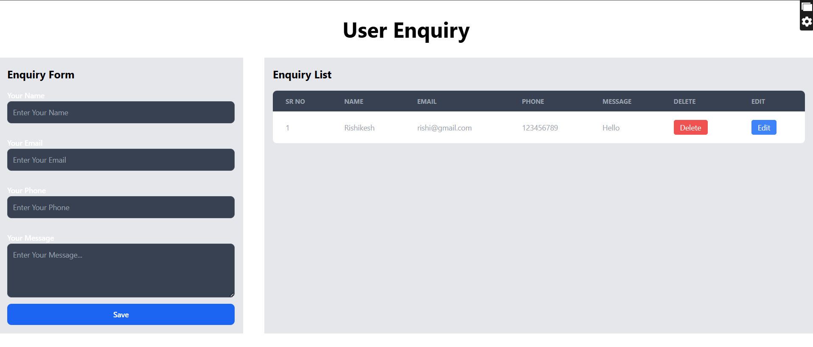

📩 Enquiry Management System

A simple MERN-based Enquiry Management module that allows users to submit enquiries and admins to view, edit, and delete them. The project includes a Node.js + Express backend with MongoDB and a React frontend using Flowbite components.

🚀 Features

1)Add new enquiries

2)View all enquiries in a table

3)Edit enquiry

4)Delete enquiry

5)React Toastify notifications

6)Flowbite UI components

7)REST API with MongoDB (Mongoose)

🔧 Tech Stack
Frontend: React.js, Axios, Flowbite React, React Toastify
Backend: Node.js, Express.js, MongoDB, Mongoose, CORS, dotenv

🛠 Installation & Setup
Backend Setup
cd server
npm install

Create a .env file:
DBURL=your_mongodb_connection_url
PORT=8020

Run server:
npm start
Frontend Setup
cd client
npm install
npm run dev

📡 API Endpoints
Base URL:
/api/website/enquiry

| Method | Endpoint      | Description        |
| ------ | ------------- | ------------------ |
| POST   | `/create`     | Create new enquiry |
| GET    | `/`           | Get all enquiries  |
| DELETE | `/delete/:id` | Delete enquiry     |
| PUT    | `/update/:id` | Update enquiry     |
🖼 Screenshots
Home Page 
